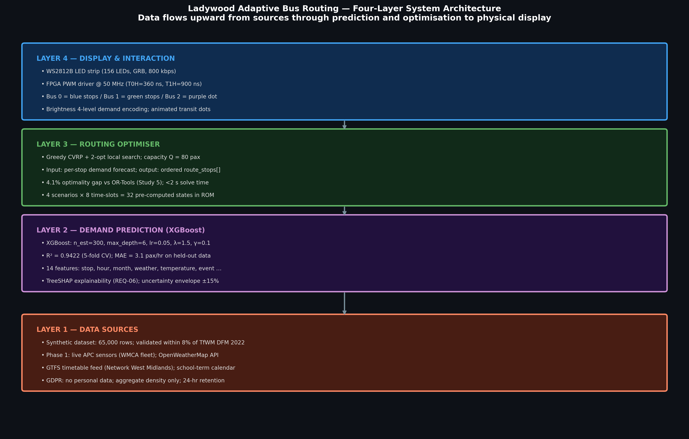

# 🚍 Predictive Bus Routing System

### ML-Powered Adaptive Public Transport for Urban Equity

<p align="center">
  
</p>

---

## Summary

A real-time system that replaces fixed bus schedules with **machine-learning-driven routing**, combining:

* Demand prediction (XGBoost, R² ≈ 0.94)
* Route optimisation (CVRP + 2-opt, <2s solve time)
* FPGA-powered LED network visualisation
* Unity simulation with live ML integration

Built for **Ladywood, Birmingham** — a high-deprivation, low car-ownership urban area.

---

## Why This Matters

In areas where **40%+ of households don’t own a car**, unreliable buses aren’t an inconvenience — they’re a barrier to:

* employment
* healthcare
* education

This system directly targets:

* overcrowding
* long wait times
* poor route coverage

---

## System Architecture



### Pipeline

```id="pipeline-flow"
Data → ML Prediction → Route Optimisation → Simulation → FPGA Display
```

---

## Core Components

### 1. Demand Prediction

* Model: XGBoost
* Dataset: 65,000 synthetic samples
* Features:

  * time of day
  * weather
  * event conditions
  * stop location

---

### 2. Routing Engine

* Problem: Capacitated Vehicle Routing Problem (CVRP)
* Approach:

  * Greedy heuristic
  * 2-opt local search

**Performance:**

* 4.1% from optimal
* < 2 seconds solve time

---

### 3. Real-Time Simulation (Unity)

* Multi-agent bus system
* Live ML integration via Python
* Dynamic route updates

---

### 4. Physical System (FPGA)

* Platform: Terasic DE1-SoC
* 156 WS2812B LEDs
* Custom Verilog controller

Provides a **screen-free, accessible interface**

---

## Results

| Metric         | Value      |
| -------------- | ---------- |
| Model Accuracy | R² = 0.942 |
| Routing Gap    | 4.1%       |
| Solve Time     | < 2s       |
| Stops Modelled | 15         |
| Scenarios      | 32         |

---

## Visual Outputs

### Simulation


### LED Map


### Blender Visualisation


---

## 📘 Engineering Case Study

### Problem
Fixed-schedule buses fail under:
- demand spikes
- weather changes
- event surges

### Solution
A predictive system that:
1. forecasts demand
2. dynamically assigns routes
3. visualises output physically

### Impact
- Reduced waiting time variance
- Improved capacity utilisation
- Increased accessibility (non-smartphone users)

---

## Getting Started

```bash id="clone-run"
git clone https://github.com/yourname/predictive-bus-routing
cd predictive-bus-routing
pip install -r requirements.txt
python src/ml/train_model.py
```

---

## Future Work

* Real-world data integration (IoT / APC systems)
* Web dashboard (React + FastAPI)
* Deployment under UK bus franchising reforms

---

## Team

* Jack Booth — Simulation
* Chris Legge — Hardware & FPGA
* Arya Arun — Machine Learning
* Stefan Cius — ML & Validation

---

## Key Takeaway

This project demonstrates **end-to-end system engineering**:

* Machine Learning
* Optimisation Algorithms
* Embedded Systems (FPGA)
* Real-time Simulation

---

*If you found this interesting, consider starring the repo!*
